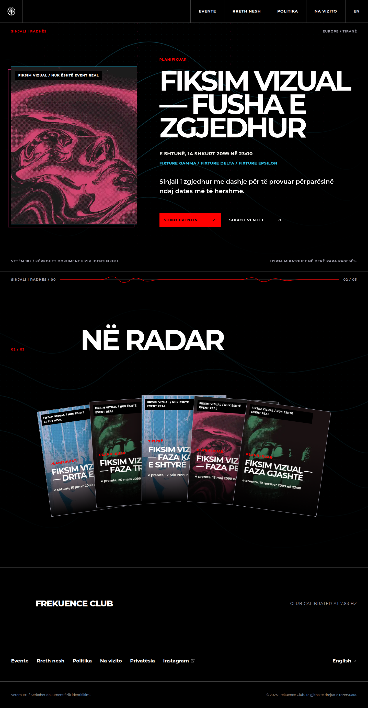
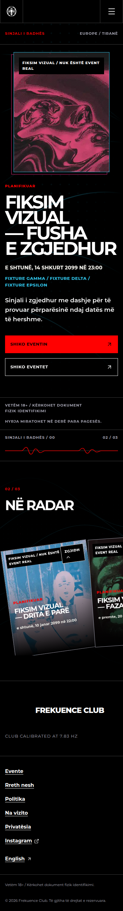
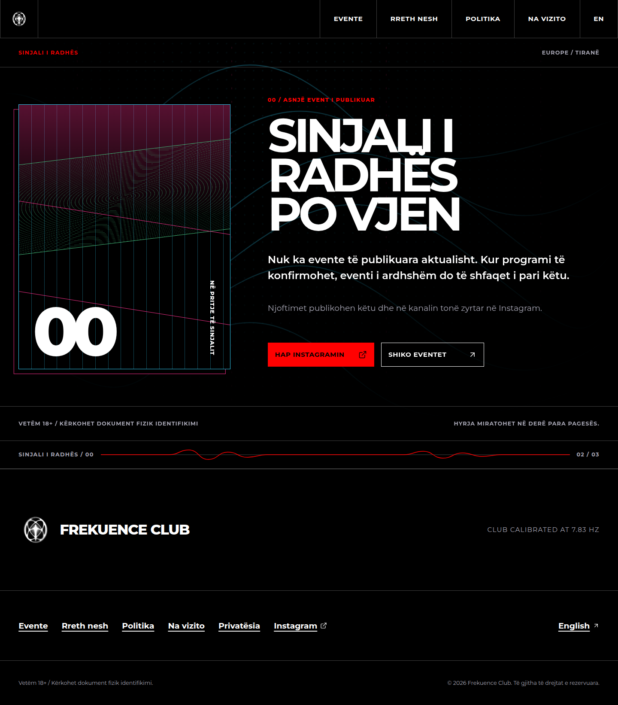
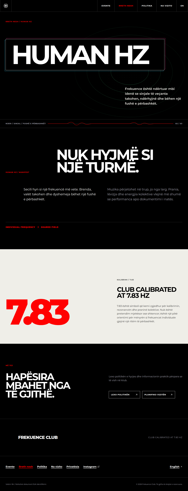
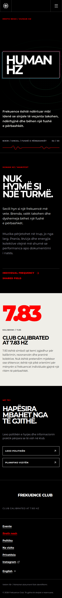

# Phase 2 foundation visual review

Generated by `npm run test:visual` on 2026-09-09. Event screenshots use the explicit
`FREKUENCE_EVENT_FIXTURES=true` build and are visibly labelled as non-production fixtures. The
empty-state and About screenshots use the normal production build.

## Homepage with events

### Desktop — 1440 × 1000

### Mobile — 390 × 844

## Homepage empty state

## About / Human Hz

### Desktop — 1440 × 1000

### Mobile — 390 × 844

